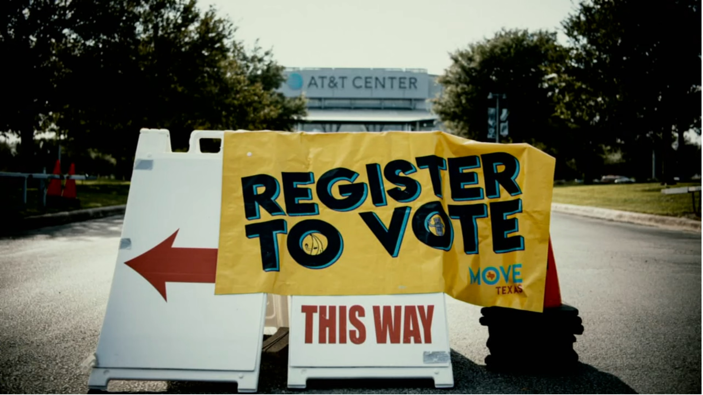
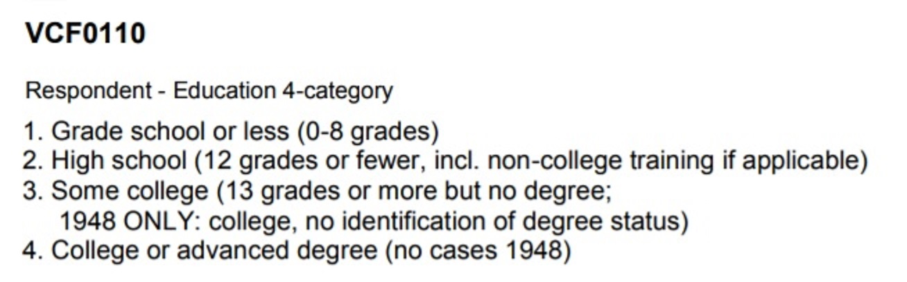
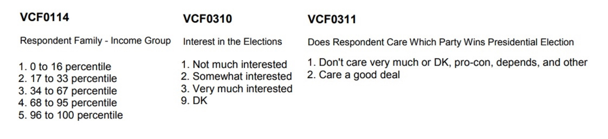

## I. Introduction

As the 2020 election is approching, politics and election issue has become casual topic nowadays. People discuss together and determine which party they are going to vote for. As individual voter, one should take all aspects into consideration to make a better choice, while as a data scientist, one should try to find something beneath the data or to be specific some potential voting patterns.

The American National Election Studies (ANES) conduct surveys of voters in the U.S. on the national scale since 1948. They take deep questions in their survey, including daily behaviors, polictial tendency and so on. It is so comprehensive that any single related filed is tip of the iceberg. On coincidence, the National Basketball Assosication reopens after the quarantine and every player print slogan on their suits. The Boston Celtics focuses on voting and education reform which inspired me a lot.


Thus, to take a deeper look at the role education played in voting and discover patterns between education and other fields, potential bias is inevitable but should be rounded to the smallest. As education for people in different races varies, in addition, People taking the ANES survey were mainly white, this project will be mainly on the effect of education for the whites.

```{r, warning=FALSE, message=FALSE, include=FALSE}
packages.used=as.list(
  c(
    "tidyverse",
    "haven",
    "devtools",
    "RColorBrewer",
    "data.table",
    "ggplot2",
    "readr",
    "corrplot")
)

check.pkg = function(x){
  if(!require(x, character.only=T)) install.packages(x, 
                                                     character.only=T,
                                                     dependence=T)
}

lapply(packages.used, check.pkg)


anes_dat <- read_sav("../data/anes_timeseries_cdf.sav")

Election_years=as.character(seq(1952, 2016, 4))

anes_use=anes_dat%>%
  mutate(
    year=as_factor(VCF0004),
    
    #vote
    turnout = as_factor(VCF0703),
    vote = as_factor(VCF0706),
    
    #natural
    race = as_factor(VCF0105a),
    gender = as_factor(VCF0104),
    
    #environment
    education = as_factor(VCF0110),
    region = as_factor(VCF0112),
    income = as_factor(VCF0114),
    
    #political issue
    self.consider = as_factor(VCF0301),
    interest = as_factor(VCF0310),
    care.win = as_factor(VCF0311),
    
  )%>%
  filter(year %in% Election_years)

data.table(anes_use%>%
             select(year, turnout, vote, race, gender, education, 
                    region, income, self.consider, interest, care.win)%>%
             filter(!is.na(turnout))%>%
             sample_n(30))

anes_use = anes_use%>%select(year, turnout, vote, race, gender, education, 
                             region, income, self.consider, interest, care.win)


anes_use <- anes_use %>% filter(!is.na(race)) %>% filter(!is.na(turnout)) %>% filter(!is.na(vote)) %>% filter(!is.na(education))


save(anes_use, file="../output/data_use.RData")
write_csv(anes_use,"../output/data_use.csv")
```


## II. Data and Selection

The data os from The American National Election Studies (ANES), and it is of high dimension. This project extracts crutial features such as voting_turnout, race, income and so on. As is illustrated above, the quality and availability of education differs from races to races, so we first take a look at the number of respondents of differentrace.

```{r, warning=FALSE, message=FALSE, echo = FALSE}
a <- anes_use$race
df_race <- data.frame(table(a))
x_names <- c("White","Black","Asian","American Indian","Hispanic","Other1968","Other1964","Missing")
df_race$a <- x_names


ggplot(df_race,aes(x=a,y=Freq))+
  geom_bar(stat="identity",fill = "orange")+coord_polar(theta = "y")+
  labs(
    x = "",
    y = "",
    title = "Number of Respondents of Different Race"
  )
```

From the above plot, respondents of other races are far fewer than whites, and this project decides to only extract survey answers from the whites to do later on researches. And the final number of respondents will come to 24611, which is still big enough to simulate normal people's behavior.

```{r, warning=FALSE, message=FALSE, echo = FALSE}
anes_white <- anes_use %>% filter(race == "1. White non-Hispanic (1948-2012)" ) %>% select(-race,-gender,-region)
```

### III. How do Education Affects Voting?

We first take a closer look at the discription of education variable.



Actually there are different variables describing the education level of respondents, and VCF0110 itself is one of them. Compared to others, VCF0110 prevails with simpicity and clearity. We should never distinguish poeple in top universities from those in average ones, however education grades should be the only criteria.

After learning from the education level, the first thing to check is whether there exist a kind of tendency for under-educated or well-educated. As the following graph shows, people who took less than 8 grades may have a good chance voting for nothing. Also, the more one is educated, the less the probability of not voting for president.

```{r, warning=FALSE, message=FALSE, echo = FALSE}
anes_vote_to_education_year = anes_white %>%
  group_by(year, education)%>%
  count(vote)%>%
  group_by(year, education)%>%
  mutate(
    prop=n/sum(n)
  )

ggplot(anes_vote_to_education_year, 
       aes(x=year, y=prop, fill=vote)) +
  geom_bar(stat="identity", colour="black") + facet_wrap(~education, ncol=1) + theme_bw()+
  theme(axis.text.x = element_text(angle = 90))+
  scale_fill_brewer(palette="Blues")+
  labs(title="How did Different Education Groups Acted in the Election?")
```

In addition, the third feature "3.Major third party" only appears in 1968,1980 and is especially significant in 1992. To explain this, some important global issue may help. First of all, the cold war is over with the disintegration of Soviet Union. Together with the end of gulf war, it makes military competition over, and the United States faced Economy problem. In this situation, some people supported the wealthy businessman Ross Perot. In this way, effects from wars and economy largely affected people's voting behavior and that is not what we want since it is not common.

Also, the sudden decrease in graph 1 at 2012 and 2016 is conspicious, to explain this, we change the graph structure, ploting the component of supporters for each party.

```{r, warning=FALSE, message=FALSE, echo = FALSE}
anes_white <- anes_white %>% filter(vote !="3. Major third party candidate (Wallace 1968/Anderson")

anes_education_to_vote_year = anes_white %>%
  group_by(year, vote)%>%
  count(education)%>%
  group_by(year, vote)%>%
  mutate(
    prop=n/sum(n)
  )

ggplot(anes_education_to_vote_year, 
       aes(x=year, y=prop, fill=education)) +
  geom_bar(stat="identity", colour="black") + facet_wrap(~vote, ncol=1) + theme_bw()+
  theme(axis.text.x = element_text(angle = 90))+
  scale_fill_brewer(palette="Blues")+
  labs(title="Education Level of People supporting the Candidates?")
```

From this perspective, we see that the voters for others, including the third party is chaotic, which coincides with reality, because the election is mainly the competition between the Democrat and the Republican, voters for the third party make up little percentage of the whole, and such small number may less likely to create patterns.

And to see voters for Democrat, Republican and Not voting, people with education level 8 or less become fewer and fewer, which may result from the total number of under-educated is becoming less. The Democrat attrachs more well-educated than Republican, which mostly rely on people graduating from high school and some college.

To explain the sudden decrease in graph 1 at 2012 and 2016, and varify the education development, the education level plot follows:

```{r, warning=FALSE, message=FALSE, echo = FALSE}
anes_education_to_year = anes_white %>%
  group_by(year)%>%
  count(education)%>%
  group_by(year)%>%
  mutate(
    prop=n/sum(n)
  )

ggplot(anes_education_to_year, 
       aes(x=year, y=prop, fill=education)) +
  geom_bar(stat="identity", colour="white") + theme_bw()+
  theme(axis.text.x = element_text(angle = 90))+
  scale_fill_brewer(palette="BuPu")+
  labs(title="The Proportion of People with Different Education Level over years")
    
```

It is quite clear that the education level of people keeps improving for decades, and in 2016, number of people with 8 or less grade is so small that can be ignored, which perfectly explained that sudden decrease.

Notice that schools may emphasize the importance of voting, and emperically, the more one is educated, the more he is interested in and curious about politics, we want to check if the well-educated will take their voting rights, whoever they votr for.

The graph follows. As analyzed above, people with higher education tend to register and vote, and the percentage of voting keep at a high level from 1948 through 2016. People with high school and College level education also improves year by year, and the percentage of voting keeps rising. For the under-educated, this graph is misleading for the reason that only a very small number of people is at 8 or less grade, which may tell fake patterns. However, the good news is the=is small number is still shrinking and the education reform takes a good effect on them.


```{r, warning=FALSE, message=FALSE, echo = FALSE}
anes_vote_education = anes_white %>%
  group_by(year,education)%>%
  count(turnout)%>%
  group_by(year,education)%>%
  mutate(
    prop=n/sum(n)
  )

ggplot(anes_vote_education, 
       aes(x=year, y=prop, fill=turnout)) +
  geom_bar(stat="identity", colour="white") + facet_wrap(~education, ncol=1) +theme_bw()+
  theme(axis.text.x = element_text(angle = 90))+
  scale_fill_brewer(palette="BuPu")+
  labs(title="Did They Really Vote?")
```

### IV. How do Education Relates to other Features?

Learning that Education have a big effect on voting behaviors, we would like to know whether there exists an relationship between education levels and other variables. From the following Figure , expect for education, income, interest and whether caring win can be considered numeric variables while others are categorical, and to make variable numeric, we should get rid of those NAs. Keeping these numeric variables, we can calculate the covariance matrix to detect the relationship beneath. 



```{r, warning=FALSE, message=FALSE, echo = FALSE}
anes_cor <- (anes_white %>% select(education,income,interest,care.win) 
  %>% filter(education !="0. DK; NA; no Pre IW; short-form 'new' Cross Section" )
  %>% filter(income !="0. DK; NA; refused to answer; no Pre IW")
  %>% filter(interest !="0. NA; no Pre IW; version B (2008)" & interest !="9. DK")
  %>% filter(care.win !="0. NA; no Pre IW" ))

fct_to_int <- function(x){
  return(as.integer(as_factor(x)))
}

anes_int <- apply(anes_cor,2,fct_to_int)
anes_int_wo_na <- na.omit(anes_int)

corrplot(cor(anes_int_wo_na),type="upper")
```

From the correlation plot, we can tell that people's interest toward election and their care for winning are positively related, which means one interested in election may possibly care a lot for winning. Also, Education level has negtive correlation with interst and care.win variable, because as set by factor in the data set, Education level means bigger number, however more interest and more care means smaller number. That is for well-educated people, there will be a tendency on more interest on election and more care for winning.

```{r, warning=FALSE, message=FALSE, echo = FALSE}
anes_white <- na.omit(anes_white %>% select(-care.win))

anes_vote_education = anes_white %>%
  group_by(year,education)%>%
  count(interest)%>%
  group_by(year,education)%>%
  mutate(
    prop=n/sum(n)
  )

ggplot(anes_vote_education, 
       aes(x=year, y=prop,group=interest)) +
  geom_line(aes(colour=interest)) + facet_wrap(~education, ncol=1) +theme_bw()+
  labs(title="Interest v.s. Education Level over years")
```

As dedicated in the above Figure, people somewhat interested approximately keeps in the same level for the four groups, maybe because of that people would have clear mind for whether interested or not, and those who have an obscure answer are people indifferent with the questions, which is unrelavent with their education levels. Also, people with not much interest makes up apparently larger proportion for the first two group, and are significantly fewer in the last two group, which coincides with the above correlation plot.

### IV. Votes Affected by Education together with other Features?

Finally, we want to know What is affected by education together with other features. Needless to say, relatively large absolute value of correlation will bring colinearity to data analysis. Following the correlation plot, we continue on checking the coeffect on voting with the combination of education and income group. The proportion Figure follows:  


```{r, warning=FALSE, message=FALSE, echo = FALSE}
anes_vote_education = anes_white %>%
  group_by(income,education)%>%
  count(vote)%>%
  group_by(income,education)%>%
  mutate(
    prop=n/sum(n)
  )

ggplot(anes_vote_education, 
       aes(x=income, y=prop, fill=vote)) +
  geom_bar(stat="identity", colour="white") + facet_wrap(~education, ncol=1) +
  theme_bw()+theme(axis.text.x=element_blank())+
  scale_fill_brewer(palette="RdPu")+
  labs(x="Income(Low -> High)",title="Votes v.s Income for Education Groups")
```

We can detect obvious pattern in Figure, but the trend is alike in the four group, or to be more specific, it acts like a meanshift from the same shape, which cannot be detected from correlation numerics. When choosing a single group, we can easily tell that wealthy people have a better chance of voting and their vote are more likely going to the Republican. From the other perspective, when keeping focus on a single column, the same thing happens with education level. That is well-educated will vote more, and their votes may go to the Democrat side.

Besides, education can make people more clear about themselves and reach a better self identification. Taking the self party identification as an example, people in different education group acts differently.

```{r, warning=FALSE, message=FALSE, echo = FALSE}
anes_vote_education = anes_white %>%
  group_by(self.consider,education)%>%
  count(vote)%>%
  group_by(self.consider,education)%>%
  mutate(
    prop=n/sum(n)
  )

ggplot(anes_vote_education, 
       aes(x=self.consider, y=n, fill=vote)) +
  geom_bar(stat="identity", colour="white") + facet_wrap(~education, ncol=1) +theme_bw()+
  scale_fill_brewer(palette="RdPu")+ theme(axis.text.x = element_text(angle = 90))+theme(axis.text.x=element_blank())+
  labs(y="",x="Self-Consideration(Democrat -> Independent -> Republican)",
       title="Votes v.s. Self-Consideration for Education Groups ")
```

From Figure, People in college or have an advanced degree would have a clear self identification, only a small part defining themselves as independent. Also, Apart from those who did not vote, when well-educated people have already defined himself, his vote is almost there, and it is very rare for a self-defined Republican to vote for Democrat. On the other hand, under-educated people may define themselves ambiguously and may make misleading self-portrait. Maybe an inspiring speech or a new policy can get them going to the othe end.

### V. Summary and Bias

Education makes a very important role in forming voting patterns, especially when combined with another categorical factor. The most significant part is that people find the importance of voting through education, and will truely think that their votes really count. The relationship between education and their voting party is somewhat fragile and maybe it can be explained by an intermediary feature, acting like a bridge. Not only for determining voting parties, education could also make oneself get a better self portrait, and act in his onw way, with little inference by others. Thus, education reform should indeed be properly undertake.

Throughout this analysis, there are potential bias that can intervene the relationship a little. Firstly speaking, people may tend to tell fake education levels and this kind of fake is usually higher than their true education level. Also, there are survey takes rndomly choosing the answer or just choose A for all the questions, which may result in high correlation between numeric features, that is as the correlation matrix illustrated, education and income is not tighted related and may remain true taking consideration of those survey takers, however, the positive correlation between education and interest in election may be reduced to lower level. 

And to speak generally, there could be more specific questions such as the main reason for voting. For example, if when extracting all those choosing income for the main reason, we can then separate them into groups and reach a more comprehensive conclusion. Taking more features into consideration and getting more answers to link some of the features, more progress would be made in this studying fied. 
